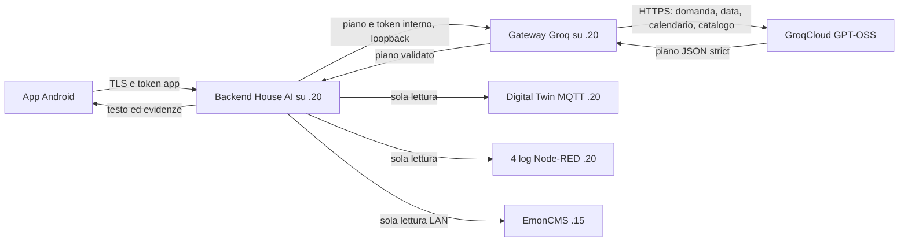

# Gateway del modello: decisione, architettura e replica

## Manutenzione del documento

Questo è il documento canonico per le scelte relative a modello, provider
Groq, gateway e collegamento Tailscale. Deve essere aggiornato nello stesso
commit di ogni modifica a questi componenti, includendo motivazione, impatto,
configurazione, verifica, replica e rollback. Costi, quote, modelli disponibili
e prestazioni dipendenti dal provider devono riportare la data della verifica e
devono essere ricontrollati prima di una nuova installazione.

La regola completa è definita in
[`POLITICA_FILE_E_RIPRESA.md`](POLITICA_FILE_E_RIPRESA.md).

Stato verificato il 13 settembre 2026. Questo documento separa l'architettura
scelta, le prove temporanee e l'installazione persistente completata su `.20`,
descritta in [`DEPLOYMENT_20_TLS_2026-09-13.md`](DEPLOYMENT_20_TLS_2026-09-13.md).
Prezzi, modelli e quote cloud possono cambiare: verificare le fonti collegate.

## Decisione e motivazioni

Il modello viene eseguito su GroqCloud; il Raspberry ospita due piccoli processi
Python: gateway e backend deterministico. Il modello interpreta la domanda e
produce un piano chiuso. Non vede i valori della casa e non calcola energia.
EmonCMS, Digital Twin e log vengono letti soltanto dopo la validazione completa.

Modello consigliato: `openai/gpt-oss-120b`; alternativa più economica:
`openai/gpt-oss-20b`. Entrambi supportano Structured Outputs strict. Nella prova
iniziale il 20B ha superato 12 casi su 16: ha omesso parte di una domanda
composta, sbagliato una settimana di calendario e risolto due ambiguità senza
chiedere. Sono stati quindi aggiunti calendario calcolato e regole esplicite.
Il 120B ha superato 12 dei primi 13 casi completati; ha chiesto un chiarimento
superfluo sulla produzione FV corrente. Sono dati di una piccola suite interna,
non un benchmark indipendente né una garanzia per ogni frase italiana.

La scelta cloud evita un LLM sui Raspberry da 2 GB. `.20`, con circa 1 GB di RAM
disponibile, può ospitare il gateway standard-library. `.15`, 32 bit con root e
swap esaurite, resta EmonCMS. Un Raspberry più potente può replicare la stessa
architettura; più RAM aumenta il margine del backend, non accelera GroqCloud.

## Costi, quote e prestazioni

Fonti ufficiali consultate il 13 settembre 2026: [GPT-OSS 20B](https://console.groq.com/docs/model/openai/gpt-oss-20b),
[GPT-OSS 120B](https://console.groq.com/docs/model/openai/gpt-oss-120b),
[Structured Outputs](https://console.groq.com/docs/structured-outputs) e
[limiti Groq](https://console.groq.com/docs/rate-limits).

| Modello | Input / 1M token | Output / 1M token | Velocità indicativa | Prova DomoPi |
|---|---:|---:|---:|---|
| GPT-OSS 20B | USD 0,075 | USD 0,30 | circa 1.000 token/s | 12/16 prima delle correzioni |
| GPT-OSS 120B | USD 0,15 | USD 0,60 | circa 500 token/s | 12/13 nei casi completati |

Il piano Free pubblicato indica per entrambi 30 richieste/minuto, 1.000/giorno,
8.000 token/minuto e 200.000 token/giorno, per organizzazione. Contano i limiti
effettivi mostrati nella console. HTTP 429 indica quota superata. Il gateway non
ritenta automaticamente: evita duplicazioni e attese imprevedibili. La suite
live usa 20 secondi fra richieste perché il catalogo ripetuto pesa sui token.

Il piano Free non offre un impegno di disponibilità. I prezzi valgono per un
eventuale uso a consumo e non implicano che sia stato abilitato un pagamento.
Prima di un piano a pagamento impostare uno spend limit nella console. Le prove
live hanno richiesto circa 0,6–1,8 secondi lato modello; sono campioni singoli,
non percentili di produzione. Lo storico dipende anche da EmonCMS e Android ha
timeout 120 secondi. Backend e gateway sono seriali, adeguati al basso traffico
di una casa; la concorrenza multiutente non è stata qualificata.

## Architettura e dati inviati



Groq riceve domanda, data, timezone, calendario e catalogo. Non riceve snapshot
MQTT, campioni EmonCMS, contenuto dei log, risultati o credenziali domestiche.
La domanda può contenere dati personali scritti/dettati e viene elaborata nel
cloud: vedere [Your Data in GroqCloud](https://console.groq.com/docs/your-data).

Lo schema ammette solo `energy_metric`, `energy_daily_extreme`,
`current_energy_metric`, `backend_log_day` ed `energy_comparison`, con oggetti
chiusi e massimo sei operazioni. `energy_daily_extreme` legge una metrica storica
una sola volta, la integra per giorni di calendario `Europe/Rome`, esclude quelli
senza copertura completa dal confronto omogeneo e seleziona massimo o minimo; i
valori parziali restano disponibili come energia osservata con la propria
copertura. A parità conserva il primo giorno cronologico. `validate_plan`
ricontrolla tool, metriche, date, modalità,
budget e riferimenti prima di qualsiasi lettura. Il testo finale è deterministico. Non esistono tool
di scrittura, MQTT `/cmd`, shell o attuazione. Output invalido, refusal, timeout,
redirect o dimensione eccessiva falliscono chiusi con HTTP 502 sanitizzato.

## Inventario reale

### `.20` — `domopi`, host candidato

Verificato via SSH in sola lettura:

- Raspberry Pi 4 Rev 1.5, ARM64, Debian 11, Python 3.9.2;
- Node-RED e Mosquitto attivi; `mosquitto-clients` 2.0.11;
- Node.js 22.23.2; log in `/home/pi/AI_climate` prodotti da Node-RED;
- `/home/pi/.config/house-ai/groq.key`, `pi:pi`, modo `600`, 56 byte; il
  contenuto non è stato stampato né committato;
- TLS, chiave e inferenze Groq reali verificati senza SDK o pacchetti pip;
- backend e gateway installati come servizi systemd persistenti e collegati
  all'app tramite Tailscale Serve; dettagli e rollback nel documento di deployment.

Le prove hanno letto i cinque topic pubblici `zara/interface/energy/.../stat`,
i quattro log e il catalogo EmonCMS. Il test Android end-to-end è passato e i
processi/tunnel temporanei sono stati chiusi. Numeri e limiti sono in
[VERIFICA_GATEWAY_REALE_2026-09-13.md](VERIFICA_GATEWAY_REALE_2026-09-13.md).

### `.15` — `emonpi`, sorgente storica

Inventario comunicato dall'utente e verifica applicativa precedente:

- Raspberry Pi 4 Rev 1.4, ARMv7 32 bit, Raspbian 10, Python 3.7.3;
- EmonCMS con 256 feed; dati su volume separato con circa 45 GB liberi;
- root 4,1 GB al 100%, 38 MB liberi; swap 58 MB esaurita;
- nessun gateway, chiave Groq o componente House AI installato;
- il backend accederà a `http://192.168.1.15/emoncms` con chiave read-only.

Non servono modifiche a `.15`. L'SSH non interattivo non è disponibile, quindi
le versioni dei suoi pacchetti non sono state ricontrollate in questa sessione.

## Software versionato

- `model_gateway.py`: Groq, prompt, calendario, schema strict, validazione e key file;
- `server.py`, `assistant.py`, `energy_tools.py`, `energy_history.py`, `log_tools.py`:
  API, orchestrazione, calcoli e accesso alle fonti;
- `planner.py`: protocollo privato backend-gateway;
- `tools/evaluate_planner.py`: 16 domande italiane, pausa predefinita 20 secondi;
- `deploy/`: environment di esempio, unità systemd e verifica post-installazione;
- `HouseAiLiveGatewayTest.kt`: test Android opt-in; non parte nei test ordinari.

La diagnostica autenticata e il significato dello stato Groq sono descritti in
[`DIAGNOSTICA_STACK_SMART.md`](DIAGNOSTICA_STACK_SMART.md). Il controllo non
genera inferenze periodiche e non consuma quota Groq autonomamente.

È sufficiente Python 3.9 standard library. Non servono pip, Docker, LiteLLM,
Ollama o llama.cpp. Questi ultimi restano alternative per un futuro modello
locale e richiederebbero nuove prove di RAM, temperatura, latenza e qualità.

## Gestione delle chiavi

I segreti sono separati: `GROQ_API_KEY`, `HOUSE_AI_PLANNER_TOKEN` interno,
`HOUSE_AI_TOKEN` dell'app e chiave EmonCMS read-only. Non riusare valori. Generare
i token House AI con almeno 32 byte casuali direttamente sul server, per esempio
`openssl rand -base64 32`, e non passarli come argomenti di processo.

Il gateway accetta `GROQ_API_KEY` oppure `GROQ_API_KEY_FILE`, mai entrambi. Il
file deve essere regolare, non symlink, massimo 4096 byte e senza permessi per
gruppo/altri. L'installazione proposta usa `/etc/house-ai/secrets/groq.key`,
`house-ai:house-ai`, `0600`; gli environment file sono `root:house-ai`, `0640`. Ruotare la
chiave sostituendo atomicamente il file, riavviando il gateway, verificando e
poi revocando la precedente nella console.

Se una chiave appare in Git, log, screenshot o chat, revocarla e sostituirla.
Il gateway sanitizza gli errori provider; backend e gateway non registrano query
o header. Non usare `systemctl show ... Environment` nelle verifiche condivise.

## Replica su un Raspberry più potente

Consigliati Debian/Raspberry Pi OS 64 bit supportato, Python 3.9+, almeno 2 GB
RAM, storage libero, NTP e CA TLS funzionanti. Installare con utente dedicato:

1. Clonare il repository e verificare branch/commit. Copiare il contenuto
   versionato in `/opt/domopi-house-ai`, escludendo `.validation`, build e segreti.
2. Creare utente e configurazione:

   ```sh
   sudo useradd --system --home /nonexistent --shell /usr/sbin/nologin house-ai
   sudo install -d -o root -g house-ai -m 0750 /etc/house-ai /etc/house-ai/secrets
   sudo install -o house-ai -g house-ai -m 0600 /dev/null /etc/house-ai/secrets/groq.key
   sudo install -o root -g house-ai -m 0640 backend/house_ai/deploy/gateway.env.example /etc/house-ai/gateway.env
   sudo install -o root -g house-ai -m 0640 backend/house_ai/deploy/backend.env.example /etc/house-ai/backend.env
   ```

   Inserire i segreti con editor privilegiato senza stamparli e sostituire ogni
   `REPLACE_...`. Concedere al servizio sola lettura dei log tramite gruppo/ACL.
3. Prima dei servizi:

   ```sh
   cd /opt/domopi-house-ai/backend/house_ai
   python3 -B -m unittest discover -s tests -q
   python3 -m py_compile *.py tools/*.py deploy/verify_install.py
   ```

4. Installare e verificare le unità:

   ```sh
   sudo install -o root -g root -m 0644 deploy/house-ai-gateway.service /etc/systemd/system/
   sudo install -o root -g root -m 0644 deploy/house-ai-backend.service /etc/systemd/system/
   sudo systemctl daemon-reload
   sudo systemd-analyze verify /etc/systemd/system/house-ai-gateway.service /etc/systemd/system/house-ai-backend.service
   sudo systemctl enable --now house-ai-gateway.service house-ai-backend.service
   ```

5. Caricare privatamente `/etc/house-ai/backend.env` in una shell root ed
   eseguire `python3 -B deploy/verify_install.py`.
6. Eseguire `tools/evaluate_planner.py --interval-seconds 20`, poi una domanda
   corrente, storica, confronto e ogni log, verificando piano, unità e copertura.
7. Esporre all'app solo il backend mediante TLS. Il gateway resta loopback.
   Senza TLS usare un tunnel temporaneo per la prova, non aprire 8765/8766.

Le unità sono state installate su `.20` il 13 settembre. Stato e rollback sono
documentati in [DEPLOYMENT_20_TLS_2026-09-13.md](DEPLOYMENT_20_TLS_2026-09-13.md).
`ProtectHome=read-only` e `BindReadOnlyPaths=/home/pi/AI_climate` vanno adattati
se i log cambiano percorso nella replica.

## Aggiornamento, rollback e criteri di promozione

Annotare il commit in uso e salvare environment/unità fuori dal repository.
Preparare ogni aggiornamento in una nuova directory, testarlo, fermare i servizi,
cambiare atomicamente il percorso e riavviare. Per rollback ripristinare directory
o commit precedente; non ci sono migrazioni dati.

Prima della promozione servono ancora suite linguistica indipendente, TLS verso
l'app, prova su telefono, verifica rate-limit/errori e osservazione senza comandi.
Un PASS prova il percorso consultivo indicato; non autorizza attuazioni né
modifiche a Node-RED, MQTT o EmonCMS.
