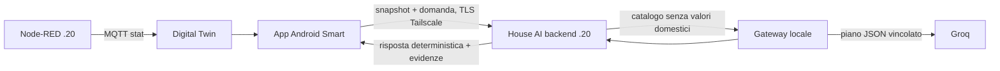

# Modalità Smart — dominio climatizzazione

Stato del 13 settembre 2026: primo incremento read-only per spiegare lo stato
dichiarato del condizionatore e il motivo registrato dal controller Node-RED.

## Obiettivo e significato della risposta

Le domande «perché il condizionatore è acceso?» e «perché è spento?» vengono
interpretate dal gateway Groq, che può scegliere soltanto il tool chiuso
`current_air_conditioner`. Il modello non vede credenziali domestiche, non legge
MQTT e non formula la risposta finale. Il backend valida il piano e compone in
modo deterministico stato, modalità aria, setpoint e motivo disponibili.

La frase «motivo registrato dal controller» è intenzionale: descrive il testo
pubblicato da Node-RED, senza trasformarlo in prova fisica o in una nuova
deduzione causale. Il flag retained e il timestamp di ricezione Android vengono
conservati; non dimostrano la freschezza della misura sorgente. Un dato mancante
rimane mancante e non viene convertito in spento, zero o temperatura predefinita.

## Contratto dati validato

L'app sottoscrive il prefisso Digital Twin già esistente e accetta esclusivamente
questi record di stato:

| Campo interno | Topic MQTT esatto |
|---|---|
| `current_state` | `zara/interface/stato_condizionatore/stato_attuale/stat` |
| `air_mode` | `zara/interface/stato_condizionatore/modalita_aria/stat` |
| `temperature_set_c` | `zara/interface/stato_condizionatore/temperatura_impostata_c/stat` |
| `recorded_reason` | `zara/interface/stato_condizionatore/motivo_logica/stat` |

I topic `/cmd`, campi sconosciuti, payload vuoti, setpoint non numerici e
osservazioni più vecchie vengono scartati. Android invia al backend lo snapshot
`house_ai.current_climate_input.v1`, con valore originale, topic, ricezione e
retained. Il backend ripete la validazione e richiede la corrispondenza esatta
fra campo e topic prima di eseguire il tool.

## Architettura della domanda e del seguito «perché?»

Dopo una risposta prodotta con `current_air_conditioner`, il backend restituisce
soltanto il contesto `{domain: climate, focus: air_conditioner}`. La schermata lo
mantiene in memoria e lo rimanda con la domanda successiva. Il backend espande
un «perché?» isolato in una domanda esplicita prima di chiamare il planner. Ogni
altro contesto viene rifiutato. Non viene salvata la conversazione, non vengono
rimandate risposte precedenti e non esiste memoria libera controllabile dal
testo dell'utente.

## Componenti e replica

Non sono necessari nuovi pacchetti, porte, servizi, chiavi o permessi. Restano
gli stessi componenti descritti in [GATEWAY_MODELLO.md](GATEWAY_MODELLO.md) e
[DEPLOYMENT_20_TLS_2026-09-13.md](DEPLOYMENT_20_TLS_2026-09-13.md): backend e
gateway Python standard library su `.20`, Groq via HTTPS, Tailscale Serve verso
il solo backend e broker/Digital Twin esistenti. `.15` resta il server EmonCMS e
non partecipa alla lettura dello stato corrente del climatizzatore.

Per replicare su un Raspberry più potente, installare la stessa release del
repository con la procedura atomica già documentata, riusare i template systemd
e configurare i file privati `/etc/house-ai`. Non copiare chiavi nel repository.
L'app deve raggiungere l'URL HTTPS della nuova macchina tramite la tailnet; il
gateway continua ad ascoltare soltanto su loopback.

## Verifica e rollback

La suite locale copre topic ammessi, provenienza, retained, valori mancanti,
setpoint invalido, contesto valido/non valido, piano chiuso e presentazione del
motivo. La compilazione Android verifica il collegamento fra MQTT, repository e
schermata Smart. La verifica reale e la revisione distribuita sono registrate
nel documento di deployment dopo l'attivazione su `.20`.

Il rollback non richiede modifiche a MQTT o Node-RED: si ripunta
`/opt/domopi-house-ai/current` alla release backend precedente e si riavviano
`house-ai-gateway` e `house-ai-backend`. L'APK precedente ignora semplicemente
i nuovi campi; nessun comando verso il climatizzatore è stato aggiunto.
